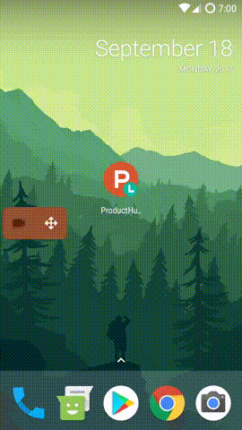

----------------------------------------------
**Spent time:** _~40 hours_

### Used technologies and libs
**Kotlin** - main programming language\
**Moxy** - MPV library\
**Retrofit2** and **OkHttp3** - for HTTP requests to API (also tried **Fuel** and **Ion**)\
**Picasso** - for image loading\
**Kotlin Coroutines** - for async work with HTTP\
**JUnit4** and **Mockito** - for tests

### Demo

### Dev process visualization
